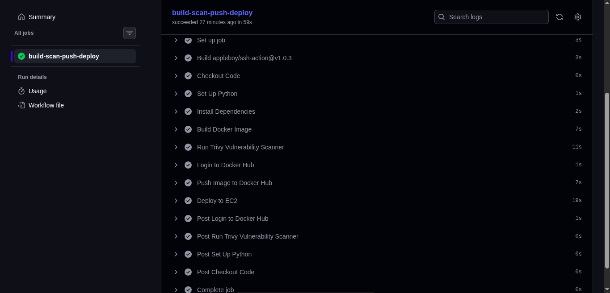
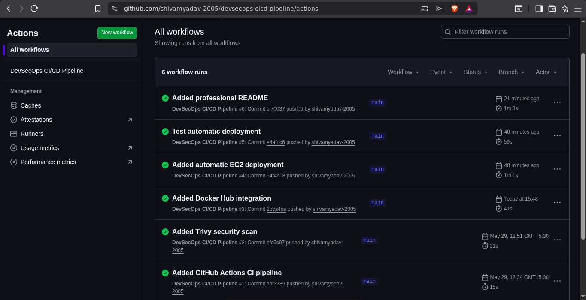
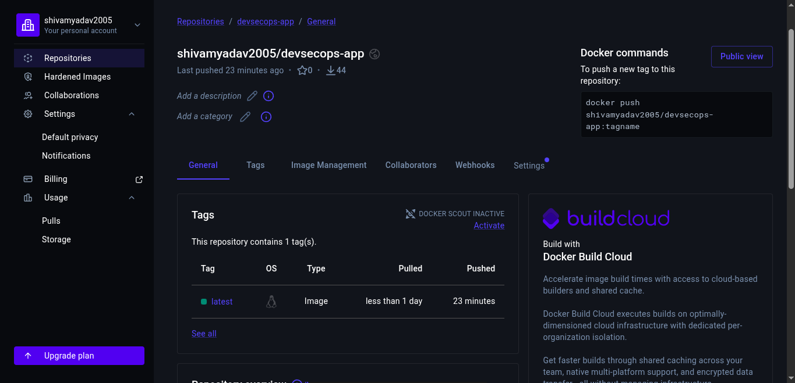
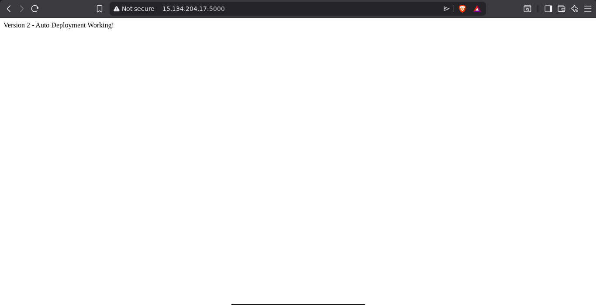

# DevSecOps CI/CD Pipeline on AWS

## Overview

This project demonstrates a complete DevSecOps CI/CD pipeline using GitHub Actions, Docker, Trivy, Docker Hub, and AWS EC2.

Every code push automatically:

* Builds a Docker image
* Performs security scanning using Trivy
* Pushes the image to Docker Hub
* Deploys the latest version to AWS EC2

---

## Architecture

Developer Push
↓
GitHub Repository
↓
GitHub Actions
↓
Docker Build
↓
Trivy Security Scan
↓
Docker Hub
↓
AWS EC2 Deployment
↓
Live Application

---

## Tech Stack

* Python Flask
* Docker
* GitHub Actions
* Trivy
* Docker Hub
* AWS EC2
* Linux
* SSH

---

## Features

* Automated CI/CD pipeline
* Containerized application
* Vulnerability scanning
* Automated deployment
* Live AWS hosting

---

## Project Structure

devsecops-cicd-pipeline/

├── app.py

├── requirements.txt

├── Dockerfile

├── README.md

└── .github/

    └── workflows/

        └── pipeline.yml

---

## Workflow

1. Developer pushes code to GitHub
2. GitHub Actions triggers automatically
3. Docker image is built
4. Trivy scans the image for vulnerabilities
5. Image is pushed to Docker Hub
6. EC2 server pulls latest image
7. Existing container is replaced
8. Application is updated automatically
---

## Screenshots

### CI/CD Pipeline Success

### GitHub Actions Workflow

### Docker Hub Repository

### Live Application on AWS EC2

---

## Live Demo

Running on AWS EC2

---

## Author

Shivam Yadav
